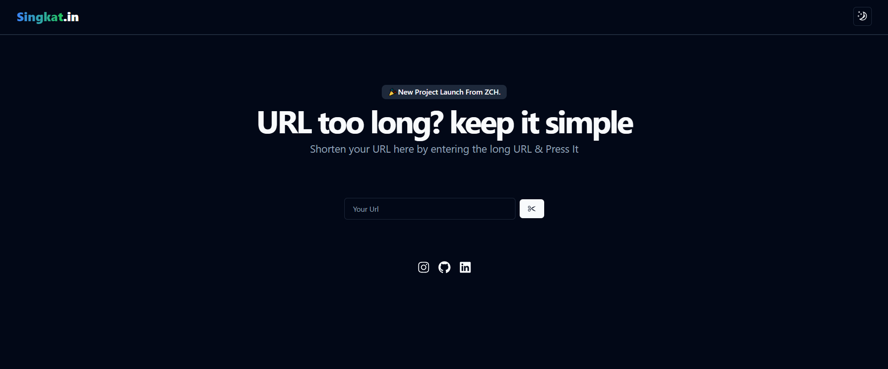

<!-- Welcome Text -->
<h1 align="center">Welcome to Singkat.in!</h1>

<!-- Description -->

Singkat.in is a practical solution to quickly and easily convert long URLs into short ones. With our service, you can generate shorter and more memorable links, ideal for shortening long and complex links.

<!-- Header Image -->

  

## Key Features

- **Short & Memorable:** Singkat.in helps you create shorter links, making them easy to remember and share.
- **Easy to Use:** Our intuitive user interface allows you to shorten URLs in just a few clicks.
- **Free and Unlimited:** Singkat.in is free to use without limitations, so you can shorten as many links as you need.

## How to Use

1. **Shorten URL:** Enter your long URL into the search box.
2. **Click Fast:** just clicking once will generate sonic power.
3. **Sharing:** Copy the newly generated link and share it with friends, family, or on your favorite social platform.

## About Us

Singkat.in is built with love by our development team to provide a simple yet effective solution for shortening links. We are committed to providing a reliable and helpful service to our users.

## Contact Us

Do you have questions, feedback, or feature requests? Feel free to contact our team via email at [rizkyzaki682@gmail.com](mailto:rizkyzaki682@gmail.com).

With Singkat.in, making links shorter and easier to remember has never been easier. Join us and start shortening your links today!

By Zach
